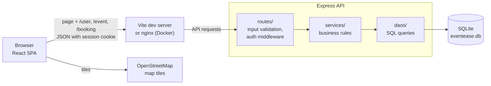

# EventEase

A full-stack web app for finding events in a city, seeing them on an interactive map, and booking tickets.


[](LICENSE)

<!--
  TODO: add a screenshot or short GIF of the app as docs/screenshot.png
  (for example: a search for "London" showing the map, the event cards and a confirmed booking),
  then remove these comment markers so the image below is displayed.


-->

**Background:** originally built as coursework for a university Web Development module, later refactored and hardened.

## What it does

- Search for events by city and see the results as a list and as pins on an OpenStreetMap map.
- Log in and book tickets: pick a ticket type (with its price and how many are left) and a quantity.
- Book directly from the list or from a pin's popup on the map.
- Refuses bookings that can't be honoured: sold-out ticket types, too many tickets, or events that already took place.
- Remembers your login across page reloads (sessions last 24 hours).

## Tech stack

- **Frontend:** React 19, Vite, React Leaflet (OpenStreetMap)
- **Backend:** Node.js, Express 4, express-session, bcrypt
- **Database:** SQLite
- **Testing:** node:test + supertest (API), Vitest + Testing Library (UI)
- **Tooling:** ESLint, Docker Compose (nginx)

## Highlights

- **No overselling under concurrent load.** A booking is one conditional `UPDATE` (only if enough tickets remain and the event hasn't happened yet) plus an `INSERT`, run as a single SQLite transaction. A test fires 20 simultaneous requests at 5 remaining tickets and checks that exactly 5 succeed.
- **Server-side authorisation.** Sessions live in httpOnly cookies and passwords are hashed with bcrypt. The server takes the booking's user from the session, never from the request, and restricts admin-only endpoints by role. Repeated failed logins are rate-limited.
- **Layered, tested API.** Routes → services → DAOs keep HTTP, business rules and SQL apart. 44 API tests run against freshly seeded databases.
- **One-command setup.** `docker compose up` builds the React app, serves it with nginx, proxies the API behind the same origin, and seeds a demo database on first start.

---

## Getting started

Demo accounts, created automatically on first start (local use only):

| Username | Password    | Role  |
|----------|-------------|-------|
| `demo`   | `demo1234`  | user  |
| `admin`  | `admin1234` | admin |

Demo cities: **London**, **Manchester**, **Liverpool**, **Birmingham**. The search matches the city name exactly.

### Option 1: Docker (recommended)

Prerequisite: [Docker](https://docs.docker.com/get-docker/) with the Compose plugin.

```bash
git clone https://github.com/Eneuss/EventEase--Event-Booking-System.git
cd EventEase--Event-Booking-System
docker compose up --build
```

Open <http://localhost:8080>.

- Stop it with `Ctrl+C` or `docker compose down`. The database is kept in a Docker volume.
- `docker compose down -v` also deletes the database, so the next start seeds fresh demo data.
- Optional: put `SESSION_SECRET=...` or `EVENTEASE_PORT=...` in a `.env` file next to `docker-compose.yml`. Without a secret, the backend uses a clearly marked development secret.

### Option 2: Node.js

Prerequisite: Node.js 22.9 or newer (24 LTS recommended; see `.nvmrc`).

Backend (terminal 1):

```bash
cd backend
npm ci
cp .env.example .env   # optional: see the file for the available settings
npm start              # API on http://localhost:3000
```

Frontend (terminal 2):

```bash
cd frontend
npm ci
npm run dev            # app on http://localhost:5173
```

The database file (`backend/data/eventease.db`) is created and seeded on the first start. Run `npm run db:reset` in `backend/` to start over with fresh demo data.

### Configuration

The backend reads these environment variables (all optional in development):

| Variable         | Default             | Purpose |
|------------------|---------------------|---------|
| `SESSION_SECRET` | dev-only secret     | Signs session cookies. **Required** when `NODE_ENV=production`; the server refuses to start without it. |
| `NODE_ENV`       | `development`       | `production` enforces the session secret. |
| `PORT`           | `3000`              | API port. |
| `DB_PATH`        | `data/eventease.db` | SQLite file, relative to `backend/`. |
| `TRUST_PROXY`    | `0`                 | Set to `1` behind a reverse proxy, so rate limiting sees the client IP. |

### Tests and linting

```bash
cd backend && npm test && npm run lint
cd frontend && npm test && npm run lint && npm run build
```

## Architecture

The React single-page app talks to a JSON API. In development the Vite dev server proxies API paths to Express. In Docker, nginx serves the built app and does the same proxying. Either way the browser sees a single origin, so the session cookie works without any CORS configuration.



**Booking flow:** `POST /booking/ticketing` → `requireAuth` checks the session → the route validates `eventID`, `ticketType` and `quantity` and takes the username from the session → `bookingService` asks `bookingsDao` to reserve tickets atomically → if nothing could be reserved, the service works out why and the route returns 404 (unknown ticket type), 400 (past event) or 409 (not enough tickets).

### API

| Method | Path                  | Access | Description |
|--------|-----------------------|--------|-------------|
| GET    | `/event/:location`    | public | Events in a city, each with its ticket types, prices and availability |
| GET    | `/event/getAll`       | public | All events, with tickets |
| POST   | `/event/create`       | admin  | Create an event |
| GET    | `/ticket/getAll`      | public | All ticket types |
| GET    | `/ticket/:eventName`  | public | Availability and price for an event, by name |
| POST   | `/ticket/create`      | admin  | Create a ticket type |
| POST   | `/booking/ticketing`  | user   | Book tickets for the logged-in user |
| GET    | `/booking/getAll`     | admin  | All bookings |
| POST   | `/user/signup`        | public | Register a normal user |
| POST   | `/user/login`         | public | Log in (rate-limited: 10 failed attempts per IP per 15 minutes) |
| POST   | `/user/logout`        | public | Log out |
| GET    | `/user/session`       | public | Current login state |
| GET    | `/user/getAll`        | admin  | All users (without password hashes) |

## Project structure

```text
.
├── backend/
│   ├── src/
│   │   ├── app.js             # Express app: middleware and route mounting
│   │   ├── server.js          # Entry point: config check, DB init, listen
│   │   ├── config.js          # Environment variables
│   │   ├── routes/            # HTTP layer: validation, status codes
│   │   ├── middleware/        # requireAuth, requireAdmin, login rate limit
│   │   ├── services/          # Business rules (signup, login, booking outcome)
│   │   ├── daos/              # SQL queries, incl. the atomic booking
│   │   ├── db/                # Connection, schema.sql, seed data, reset script
│   │   └── utils/             # Password hashing, validation, async handler
│   ├── test/                  # API tests (node:test + supertest)
│   └── Dockerfile
├── frontend/
│   ├── src/
│   │   ├── App.jsx            # Page layout, session and search state
│   │   ├── api.js             # fetch wrappers for the backend
│   │   ├── components/        # Login, EventSearch, EventList, MapView, BookingForm
│   │   └── utils/             # Date formatting
│   ├── nginx.conf             # Serves the build and proxies the API (Docker)
│   └── Dockerfile
└── docker-compose.yml
```

## Technical decisions and trade-offs

- **SQLite.** No database server to install, and the whole state is one file that's easy to reset. The trade-off: one writer at a time, and a single app instance. PostgreSQL would be the step up for concurrent writers or several API instances.
- **Server-side sessions instead of JWTs.** The cookie is httpOnly, logout really ends the session, and there is no token handling in the frontend. The default in-memory session store loses sessions on restart and doesn't scale beyond one process; a persistent store (SQLite or Redis) would fix that.
- **Same origin through a proxy instead of CORS.** Both the Vite dev server and nginx forward API paths to Express. Cookies then work without `SameSite=None` or credentialed CORS, and dev and Docker behave the same way.
- **Atomic booking in SQL, not in JavaScript.** Checking availability in JavaScript and then writing is a race: 20 parallel requests against 5 tickets produced 9 bookings before the fix. The check and the decrement are now one conditional `UPDATE`, and the `INSERT` runs only if that `UPDATE` changed a row (`WHERE changes() = 1`). The node-sqlite3 connection runs in serialized mode, so the four statements of a booking can't interleave with another request's. A synchronous driver such as better-sqlite3 would make transactions simpler, at the cost of swapping the driver.
- **ISO dates stored as text.** `YYYY-MM-DD` strings sort and compare correctly, so the "event already took place" check is `date >= date('now')` in SQL with no schema change. Dates are compared in UTC.
- **Layered backend.** Routes, services and DAOs are more structure than an app this size strictly needs. They keep SQL out of HTTP handlers and make each rule easy to find and test.
- **Test tools.** The backend uses Node's built-in test runner with supertest, so no test framework dependency. The frontend uses Vitest because it reuses Vite's config and JSX transform.

## Testing

- **Backend: 44 tests** (`backend/test/`, node:test + supertest). Each test file starts the app against its own freshly seeded temporary database. They cover:
  - event search, including ticket data
  - signup/login/logout and session restore
  - 401/403 role checks on every protected endpoint
  - no password hashes in any response
  - booking rules: session user, input validation, unknown ticket type, sold out, past event, concurrent overselling
  - login rate limiting
  - configuration (the production secret check actually starts the server)
  - schema/seed idempotency
- **Frontend: 11 tests** (Vitest + Testing Library, jsdom). Nine cover `BookingForm`: ticket options with prices and sold-out state, a successful booking, server error messages, network failure, the logged-out case and input validation. Two cover date formatting.

## Limitations and future improvements

- There's no UI for signing up, viewing or cancelling your bookings, or (for admins) creating events. Signup and event creation exist only as API endpoints.
- Location search is an exact, case-sensitive match on the city name.
- Sessions and login rate-limit counters are kept in memory: they reset when the server restarts and only work with a single instance.
- The session cookie isn't marked `secure` because the app runs over plain HTTP locally. A real deployment would need HTTPS, secure cookies and a persistent session store.
- `npm audit` reports 7 findings in the backend (including `tar`). All of them come from the build-time toolchain of `sqlite3` 5 (`node-gyp`). `sqlite3` 6 removes them, but its prebuilt binary needs glibc 2.38, which Debian 12 and Ubuntu 22.04 (and the official `node:24` Docker images) don't have.
- The map needs internet access: tiles come from OpenStreetMap and marker icons from the unpkg CDN.
- There are no automated end-to-end browser tests; the full UI flow was checked manually.

## License

[MIT](LICENSE) © 2026 Enea Rina
